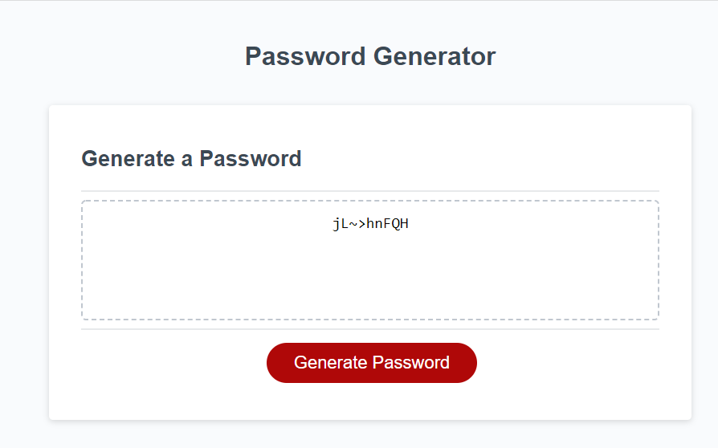

* Password -Generator
This application emphasizes the use of Javascript to generate a random, secure password for the user.

This project has been deployed to GitHub Pages. To get this project up and running, you can follow the deployment link. Or, download the sources files to use this as a template.

* Gentting Strated
* [Git Hub Repository](https://github.com/Preranashukla/Assignment3.git)
* [ Demo Video ](https://drive.google.com/file/d/18wr5qb5-fHkZ23mrRKRaWvY70-hAn0i6/view)
* [Deloped link](https://preranashukla.github.io/Assignment3/)

* Prerequisites
To install this application, you will need a text editor. I recommend Visual Studio Code.

* Installing
To install this code, download the zip file, or use GitHub's guidelines to clone the repository.

* Summary
HTML and CSS and Javascript documents create a random password generator
This project emphasizes the use of using Javascript to make dynamic changes to an HMTL document.

* A generate button
    * This will send the user a series of prompts and confirms
    * After user data is collected, a random password will be generated using Javascript

